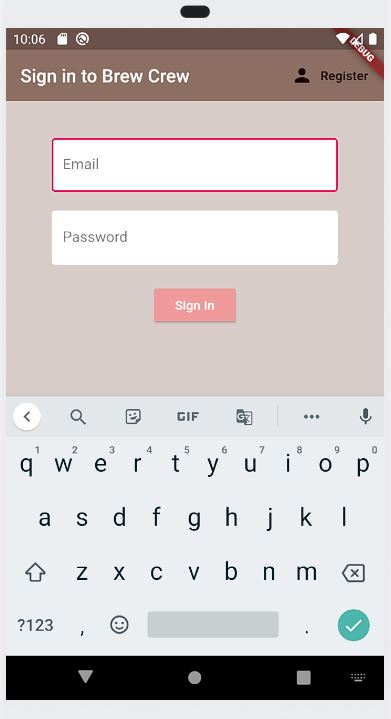
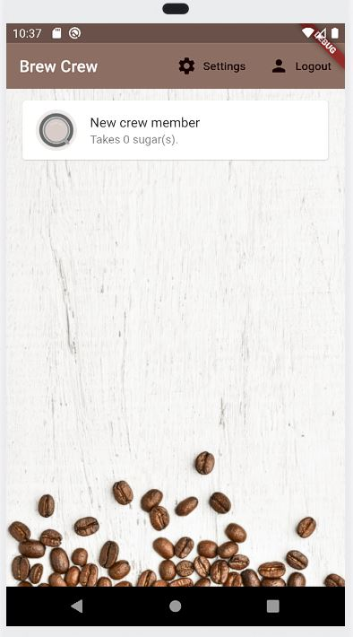

## brew_crew

Flutter and firebase application. You need to register. Then you can change and save different type coffees.

Flutter ve firebase uygulaması. Kayıt olmanız gerekiyor. Daha sonra farklı türdeki kafeleri değiştirebilir ve kaydedebilirsiniz.

  

You can register and sign in from that screen. Google keeps your password and i think it should be safe.

Bu ekrandan kayıt olabilir ve oturum açabilirsiniz. Google, şifrenizi saklar ve güvenli olması gerektiğini düşünüyorum.

  

You can change your coffee setting from clicking setting button.

Kahve ayarınızı ayar düğmesine tıklayarak değiştirebilirsiniz.
